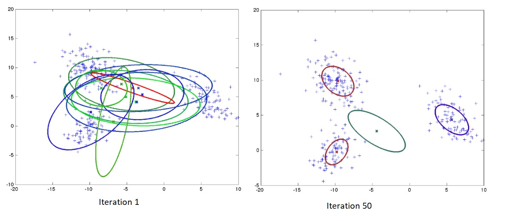
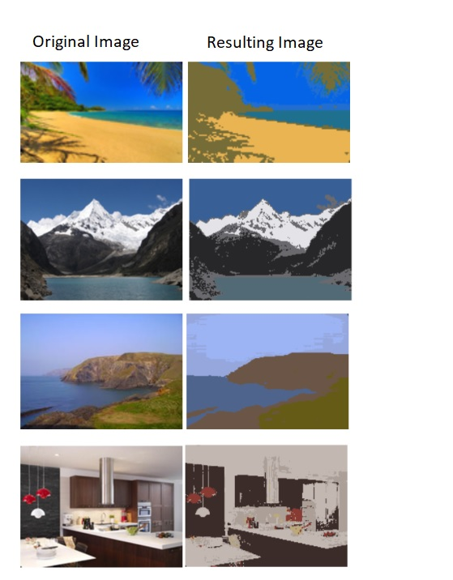

# Ritsumeikan University - Research Stay

In 2011 I had the opportunity of doing a research stay at Ritsumeikan University (Biwako campus). I joined to the Emergent Systems laboratory, and spent most of my time researching about the Infinite Gaussian Processes. The goal was to estimate data distribution as a mixture of Gaussian functions, when I say that it is an infinite process I mean that the number of Gaussian is not fixed, like in the K-means algorithm, instead the number of Gaussians can change from one iteration to the next, but at the end it is expected that the resulting number of Gaussians fit the data in the best possible way.

To create new Gaussians I used the CRP (Chinesse Restaurant Process), which is an algorithm that assigns data to a cluster, it tends to assign clusters depending on their mumber of elements already assigned to them, the idea is this: A new customer enters to the restaurant, and most lokely will sit in the table with more people, more people in the table, higher is the probability to sit in that table, but there is a small chance that the new customer sits in a new table alone, and maybe that will cause that the next customer sit in that same table.  Then each element of the data is assigned to a cluster following the same process. 

To estimate the parameters of each Gaussian I used Gibbs Samping. In the first iteration there can be multiple Gaussians, but as iterations pass by, the number of Gaussians tend to fit the data distribution. See the figure below.

The method was applied in a image segmentation  based on RGB values, basically the RGB values form a 3-dimensional space, and the goal is to indentify clusters, that will cause that pixels with similar color to be assigned to the same cluster.

